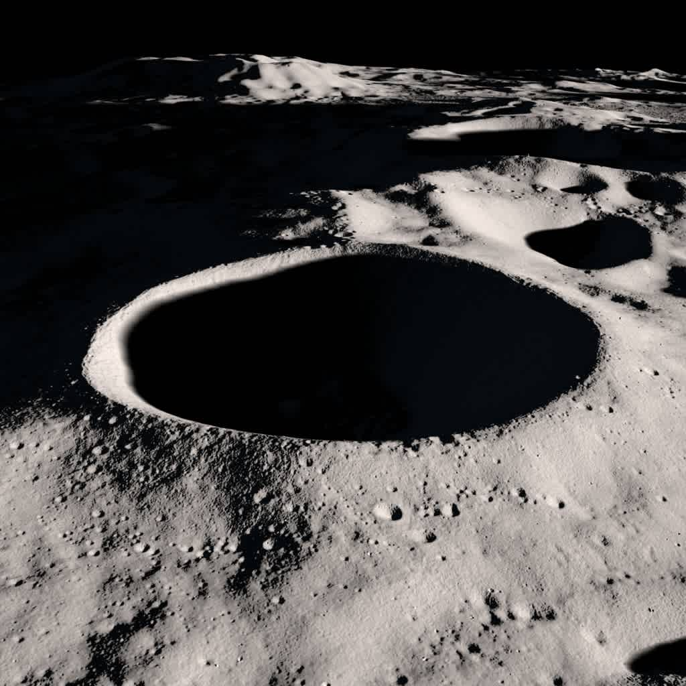
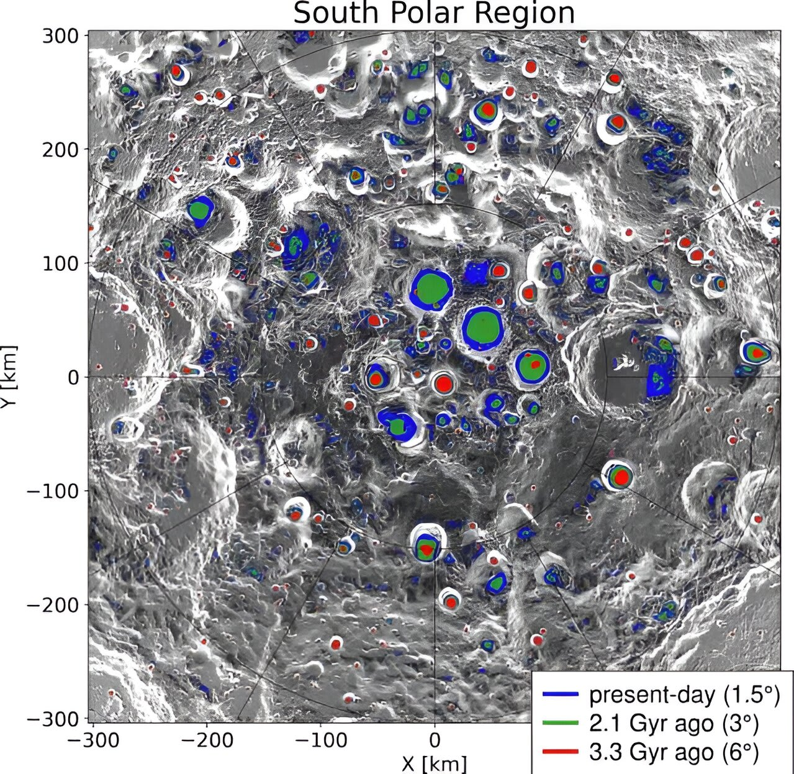

# CycleGAN-Based Lunar Surface Detail Extraction from Permanently Shadowed Regions

  
*Shackleton Crater's permanently shadowed floor, imaged by NASA's ShadowCam. [Credit: NASA/KARI/ASU]*

---

## Overview

This repository presents a **CycleGAN-based deep learning framework** for extracting surface details from the **Permanently Shadowed Regions (PSRs)** of the lunar surface. These areas, located near the Moon's poles, are extremely cold and dark, making them scientifically valuable but hard to image with conventional techniques.

Our approach leverages **unpaired image-to-image translation** to learn mappings between illuminated lunar terrains and their shadowed, low-visibility counterparts. By combining advanced neural architectures and a suite of custom loss functions, our model predicts plausible geological features in PSRs, balancing generative creativity with scientific plausibility and artifact suppression.

---

## Problem Context

- **Permanently Shadowed Regions (PSRs):**  
  Deep craters near the lunar poles that have not seen sunlight in over two billion years, remaining some of the coldest and least explored places in the solar system.  
    
  *Annotated map of PSRs at the lunar south pole. [Credit: NASA]*

- **Scientific importance:**  
  PSRs may contain preserved water ice and ancient volatiles, critical for future lunar exploration.

- **Imaging challenge:**  
  Traditional enhancement methods amplify noise or miss subtle geological features. New deep learning approaches are needed to reveal hidden details.

---

## CycleGAN Architecture

### Core Principles

- **Two Generators:**  
  - `G_AB`: Illuminated → Shadowed  
  - `G_BA`: Shadowed → Illuminated

- **Two Discriminators:**  
  - `D_A`: Real vs. Fake in Illuminated domain  
  - `D_B`: Real vs. Fake in Shadowed domain

- **Cycle Consistency:**  
  Ensures that translating an image from one domain to another and back should recover the original.

 
*CycleGAN architecture: two generators and two discriminators with cycle consistency loss. [Source: CycleGAN paper]*

---

## How CycleGAN Works

CycleGAN enables **unpaired image-to-image translation** by learning two mappings (A→B and B→A) and enforcing *cycle consistency*—if you translate an image to the other domain and back, you should get the original image.  
- **Adversarial Loss:** Each generator tries to fool its corresponding discriminator.
- **Cycle Consistency Loss:** Ensures reconstructed images resemble the originals.
- **Identity Loss:** Prevents unnecessary changes when the input is already in the target domain.

> “The cycle consistency loss ensures that an image from one domain, when translated to the other domain and then back, is similar to the original image. Using this loss makes the model preserve the underlying structure and content of the image and learn useful semantic representation and not output random images.”  
> — [viso.ai, 2025][4]

---

## Custom Loss Functions

Our implementation uses a sophisticated loss strategy to balance realism and scientific validity:

- **Adversarial Loss:** Standard GAN loss for realism.
- **Cycle Consistency Loss:**  
  - **L1 Loss:** Pixel-wise similarity.  
  - **Perceptual Loss:** Semantic similarity via VGG features.  
  - **SSIM Loss:** Structural similarity for textures and edges.
- **Identity Loss:** Same components as above, to preserve input characteristics.

**Total Loss Formula:**
Total_Loss = Adversarial_Loss + λ_cycle * Cycle_Loss + λ_identity * Identity_Loss

Each component is a weighted sum of L1, perceptual, and SSIM losses.

---

## Training Methodology

- **Mixed Precision Training:** Efficient memory usage and faster computation.
- **Gradient Clipping:** Prevents exploding gradients.
- **Custom Training Loops & Image Buffers:** Stabilize GAN training.
- **PatchGAN Discriminators:** Focus on local image patches for fine-grained realism.

---

## Results: Seeing Into the Shadows

Our approach enables the generation of plausible surface details in PSRs, revealing features previously invisible in raw images.

| Raw PSR Image | CycleGAN-Enhanced |
|:-------------:|:----------------:|
|  |  |
| *Raw ShadowCam image* | *CycleGAN-style translation result* |

> *Note: Second image is a generic CycleGAN example (zebra→horse) for illustration; insert your own lunar PSR enhancement results here.*

---

## Scientific Applications

- **Enhanced PSR Mapping:** Reveals plausible surface features for mission planning and hazard assessment.
- **Geological Analysis:** Enables studies of cratering, regolith, and boulder distributions in previously inaccessible regions.
- **Resource Assessment:** Assists in identifying potential water ice and volatile deposits for future missions.

---

## Future Directions

- **Full Self-Attention/Transformer Integration:** For improved global feature modeling.
- **Multi-Modal Data Fusion:** Incorporate hyperspectral and topographical data.
- **Real-Time Inference:** Optimize for deployment on lunar missions and edge devices.
-**Additional data collection and training: creating more data by simulating the raw images artificially using gaussian and speckle noise**

---

*For code, model details, and usage instructions, see the repository files.*

